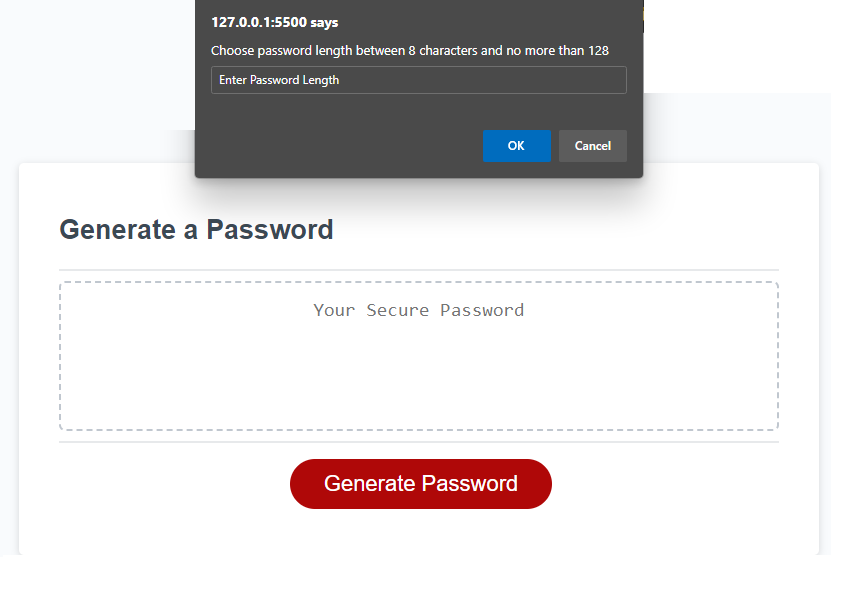
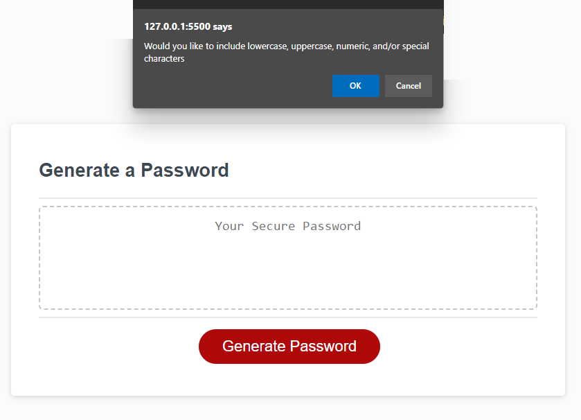
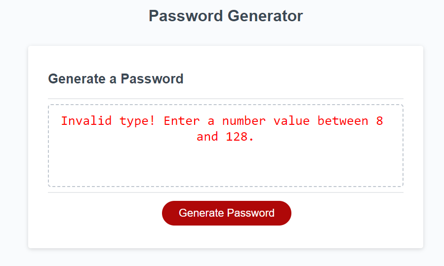

<p align="center">
    
</p>

<p align="center">
    <a href="">
        </a>
    <a href="" >
        </a>
    <a href="" >
        </a>
</p>
<br/>

# Carleton University - Bootcamp

## Module 03 JavaScript: Password Generator

The challenge this week is to create an application that enables employees to generate **random passwords** based on criteria that they’ve selected. The generated password would be displayed on the web site (already provided).


## Business Requirements
The Password Generator should allow user to define some parameters that need to be taken into consideration. The JavaScript will take care to use selected parameters while creating the password. The prompts are as follow:

<ul>
<li><strong>Password Size</strong> - User is required to give a length of at least 8 characters and no more than 128 characters.</li>
<li><strong>Allow Special Characters</strong> - User will confirm whether or not to include lowercase, uppercase, numeric, and/or special characters.</li>
<li><strong>Validation</strong> - Process will validate password based on criteria selected. Error message will be displayed
<li><strong>Error</strong> - Errors are prompted to the user. First t report the error and second tp ask if another attempt is required.</li>
</ul>

## Password Algorithm
The password generation is processed by a simple algrithm that selects characters from a string. It uses the length of the string and it returns a random character.<br/> <span style="color:cyan">Note:</span> charcters is a global variable that contains all valid characters allowed to use.

```
characters.charAt(Math.floor(Math.random() * characters.length));
```

## Notes to consider
The Password Generator uses an algorithm to select a character in the building process. This is done as many times as specified in the Password Length.

> **Note**: Parameters required in the process are as follo:
>
> * Password Length - this is a numeric field.
>
> * Allowing Special characters, numeric, upper/lower cases - these are boolean responses.
>
> * Regular Characters: abcdefghijklmnopqrstuvwxyz. Note: for uppercases we use the .ToUpperCase() string method.
>
> * Numeric Characters: 0123456789
>
> * Special Characters: !#$%&()*+,-.:;<=>?@[\]^_{|} - Some characters have been removed.
> 
> * Validation process will validate that we have satisfied the selected criteria. In case there is an error then message will be displayed on the site (see error message below).

## Snapshots
Here are the complete set of snapshots:

Prompt User for length           |  Confirm Special Chars
:-------------------------:|:-------------------------:
  |  
Error Message           
:-------------------------:
 

- - -
© 2023 edX Boot Camps LLC. Confidential and Proprietary. All Rights Reserved. Developed by Gustavo Miller
